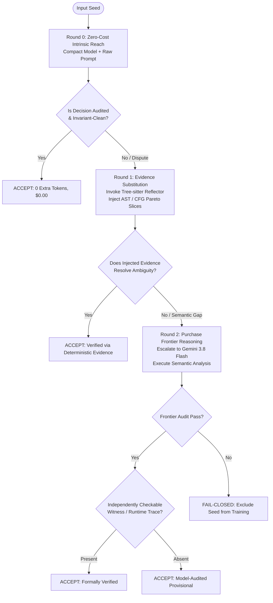

# RFC-EPISTEMIC-REACH-V1: Epistemic Reach, Evidence Substitution, and Oracle Authority

- **Document ID:** `RFC_EPISTEMIC_REACH_AND_EVIDENCE_SUBSTITUTION_V1`
- **System:** `silver-one` / BARRED-Swarm Neurosymbolic Architecture
- **Status:** Approved / Core Architectural Foundation
- **Date:** October 2026

---

## 1. Executive Summary & Foundational Thesis

In autonomous code analysis and multi-agent debate systems, empirical evaluations frequently collapse multiple distinct causal factors into a single scalar: **"benchmark accuracy"** or **"acceptance rate."** 

This conflation obscures the root causes of system failures, leading engineers to either prematurely discard valid architectures or over-invest in massive frontier LLMs to compensate for deterministic plumbing flaws.

We define the foundational epistemic thesis of the `silver-one` architecture:

> **The model has reasoning reach. The reflector has evidence reach. The oracle has labeling authority. These are not the same thing.**

```text
                 ┌────────────────────────────────────────────────────────┐
                 │                HUMAN BENCHMARK ORACLE                  │
                 │                 [Labeling Authority]                   │
                 │              "This codebase is Vulnerable"             │
                 └───────────────────────────┬────────────────────────────┘
                                             │
                                             │ asserts binary label
                                             ▼
                 ┌────────────────────────────────────────────────────────┐
                 │                  CLAIMED PREDICATE                     │
                 │            "Vulnerable via specific mechanism M"       │
                 └───────────────────────────┬────────────────────────────┘
                                             │
                       ┌─────────────────────┴─────────────────────┐
                       │                                           │
                       ▼                                           ▼
         ┌───────────────────────────┐               ┌───────────────────────────┐
         │   DETERMINISTIC REFLECTOR │               │       NEURAL MODEL        │
         │     [Evidence Reach]      │               │     [Reasoning Reach]     │
         │  AST, CFG, Dataflow,      │               │  Semantic interpretation, │
         │  Guard Enclosures, Sinks  │               │  Syscall logic, Reasoning │
         └─────────────┬─────────────┘               └─────────────┬─────────────┘
                       │                                           │
                       │ exposes structured evidence               │ evaluates validity
                       └─────────────────────┬─────────────────────┘
                                             ▼
                               ┌───────────────────────────┐
                               │   AGENT VERDICT / PROOF   │
                               │   Accepted / Rejected     │
                               └───────────────────────────┘
```

The central operational hypothesis motivating this work is:
**The primary bottleneck in multi-agent code verification is often not raw model intelligence, but the quality, structure, and sufficiency of the evidence interface between deterministic analysis and neural model reasoning.**

---

## 2. The Three Reaches Defined

### 2.1 Model Reasoning Reach
**Model reasoning reach** is the volume of the semantic and technical state space that a neural language model can independently discover, evaluate, and trace without external assistance.

```text
Gemma 4-E4B / 12B               Gemini 3.5 Flash                 Gemini 3.8 Flash
        │                               │                                │
        ▼                               ▼                                ▼
Narrow reasoning reach;         Broad semantic reach;           Deepest reach;
prone to narrative bias;        robust code understanding;      independently verifies
hallucinates mechanisms         vulnerable to subtle            POSIX syscall semantics;
when evidence is missing.       syntactic/predicate traps.      refutes deceptive narratives.
```

- **Not Scalar "Intelligence":** A model with higher reasoning reach is not simply "better at everything"; it possesses a broader horizon of latent knowledge regarding formal invariants, API contracts, and edge cases.
- **Empirical Receipt (Seed 51, `login-utils/setpwnam.c`):**  
  Seed 51 contains a classic `mktemp()` race in `/tmp`. However, the prompt asserted that the vulnerability was *"an arbitrary file overwrite in `rename(tmpname, PASSWD_FILE)` via a symbolic link"*, reinforced by a misleading developer comment.
  - **Gemma 12B & Gemini 3.5:** Accepted the claim because their reasoning reach trusted the inline comment and high-level exploit narrative.
  - **Gemini 3.8 Flash:** Rejected the claim because its reasoning reach recognized that under POSIX semantics, `rename(2)` **does not dereference symlinks**, the destination path is hardcoded to `/etc/passwd`, and `/tmp` sticky-bit semantics block unprivileged unlinking.

### 2.2 Reflector Evidence Reach
**Reflector evidence reach** is the set of objective, verifiable facts that deterministic tooling (e.g., Tree-sitter AST, control-flow graphs, call-graph reachability, type-checkers, and dataflow analyzers) can extract and explicitly place into the model's context window.

```text
Raw Source Code ──► Tree-sitter AST ──► CFG / Def-Use Chains ──► Sinks & Guards ──► Reflector Slice
```

- The reflector does **not reason**; it extracts structural properties with deterministic certainty *strictly with respect to the analyzed slice and grammar representation*.
- **Scope & Soundness Assumptions:** Deterministic guarantees are bounded by the analyzer's model and coverage. Incomplete evidence coverage, unexpanded preprocessor macros, or pointer aliasing outside the parsed slice can omit relevant whole-program context. However, for facts directly established within the analyzed slice (e.g., identifying that variable `buf` flows from `read()` to `memcpy()` without passing through a length-check node in that slice), that structural relation is deterministically established without neural hallucination risk.

### 2.3 Oracle Labeling Authority
**Oracle labeling authority** is the historical or human consensus associated with a benchmark item.

- The oracle declares: *"CVE-2016-1234 exists in this commit; label = Vulnerable."*
- **The Critical Disconnect:** The oracle's label **does not guarantee that a given vulnerability predicate supplied to the agents is technically accurate in its claimed mechanism**.
- Treating the oracle label as absolute truth about the predicate creates a fatal flaw: agents that identify genuine semantic bugs in the benchmark are marked as "incorrect," while agents that gullibly hallucinate a flawed proof matching the oracle are rewarded.

---

## 3. The Evidence Interface: A Four-Level Failure Taxonomy

When an agent fails to verify code or hallucinates an invalid exploit, engineers typically blame "model hallucination." We break the evidence pipeline into four distinct failure modes:

```text
Reflector Capability (Theoretically 100%)
   │
   ▼
[1] Parser Coverage (Can the system deserialize the reflector's structured output?)
   │
   ▼
[2] Evidence Coverage (Did the reflector extract the specific nodes/paths relevant to the bug?)
   │
   ▼
[3] Evidence Sufficiency (Is the extracted evidence logically capable of proving the predicate?)
   │
   ▼
[4] Model Utilization (Did the neural model actually condition its reasoning on the evidence?)
```

| Level | Failure Mode | Concrete Empirical Example |
| :--- | :--- | :--- |
| **1. Parser Coverage** | The reflector emitted valid data, but schema parsing / markdown stripping dropped it. | JSON regex parser dropping markdown-fenced candidates (~50% syntax drop in un-repaired responses). |
| **2. Evidence Coverage** | The tool ran, but missed the target construct. | Tree-sitter AST missing macro-expanded function definitions in complex C preprocessor blocks. |
| **3. Evidence Sufficiency** | The tool extracted all syntax, but the syntax **cannot prove the runtime invariant**. | Tree-sitter proves `tmpname` reaches `rename()`, but **cannot know** whether `rename()` dereferences symlinks under POSIX kernel semantics. |
| **4. Model Utilization** | The evidence was in the prompt, but the model hallucinated anyway. | Compact model ignoring an explicit upstream guard slice present in its context window. |

> **Key Principle:** A system can have 100% Parser Coverage and 100% Evidence Coverage, yet still fail completely because of **Evidence Insufficiency**. Static syntax alone cannot substitute for runtime contract semantics.

---

## 4. The Evidence Substitution Hypothesis

### 4.1 Conceptual Formulation
Let intrinsic model reasoning reach be $M$, and usable reflector evidence reach be $R$. Effective decision capability $E$ is governed by:

$$E \approx M + R - (M \cap R)$$

Where:
- $M \cap R$ is the **evidence overlap** (facts the model could have deduced on its own).
- **For a compact model ($M$ is small):** $M \cap R$ is small. External deterministic evidence $R$ provides massive marginal leverage.
- **For a frontier model ($M$ is large):** $M \cap R$ is large. The reflector provides bounding efficiency and token savings, but less novel semantic discovery.

### 4.2 Two Routes to Verification Capability

```text
Route A: The Frontier Model Route                    Route B: The Reflector-Assisted Route
┌──────────────────────────────────────┐            ┌──────────────────────────────────────┐
│  CODE                                │            │  CODE                                │
│   │                                  │            │   │                                  │
│   ▼                                  │            │   ▼                                  │
│  FRONTIER MODEL (Gemini 3.8)         │            │  TREE-SITTER REFLECTOR               │
│   │                                  │            │   │                                  │
│   ├─ Internalized AST tracing        │            │   ▼                                  │
│   ├─ Inferred CFG reachability       │            │  STRUCTURED EVIDENCE SLICE           │
│   └─ Native POSIX contract knowledge │            │   │                                  │
│   │                                  │            │   ▼                                  │
│   ▼                                  │            │  COMPACT MODEL (Gemma 12B)           │
│  VERIFIED DECISION                   │            │   │                                  │
│  [Cost: $0.17 / row, 80k tokens]     │            │   ▼                                  │
│                                      │            │  VERIFIED DECISION                   │
│                                      │            │  [Cost: $0.00 / row, 24k tokens]     │
└──────────────────────────────────────┘            └──────────────────────────────────────┘
```

**Route A purchases capability through compute and parameter scale.**  
**Route B purchases capability through deterministic software engineering.**

---

## 5. Empirical Receipts

### Receipt 1: The Gemma 12B Expansion Audit (50 Attempts)
We ran the Gemma 12B model (`google/gemma-4-12b-qat` via LM Studio) as an unassisted Phase B Explainer against Gemini 3.8 Flash as the Phase C Semantic Auditor across 50 raw CVE snippets:

- **Total Calls:** 50
- **Accepted Seeds:** 5 (10.0% marginal yield)
- **Rejected Attempts:** 45 (90.0% rejection rate)

#### Breakdown of 45 Rejections:
```text
  33  (73.3%)  audit_rejected_flawed_mechanism
   5  (11.1%)  missing_vulnerability_class
   3  ( 6.7%)  audit_rejected_upstream_preempted
   2  ( 4.4%)  audit_rejected_label_mismatch
   1  ( 2.2%)  predicate_contains_hedging_or_placeholder
   1  ( 2.2%)  audit_rejected_context_deficient
```

**The Diagnosis:**  
When deprived of deterministic evidence reach, Gemma 12B suffered **evidence starvation**. It was forced to speculate on raw C code, inventing mechanisms that were physically impossible under language semantics (e.g., claiming a UAF on statically allocated structs or an OOB read on guarded arrays). Gemini 3.8 Flash dismantled 73.3% of these attempts with formal code proofs.

### Receipt 2: The Pilot 10 Comparative Matrix (Seeds 42–51)

> **Label Contract Clarification:**  
> The class-conditioned metrics below evaluate acceptance against the **historical benchmark Oracle** (5 Safe / 5 Vulnerable). However, our subsequent semantic audit (Section 2.1) revealed that Seed 51's claimed vulnerability predicate is technically invalid under POSIX semantics, shifting the verified technical ground truth to 6 Safe / 4 Vulnerable. Caution is warranted when directly comparing class-conditioned rates across differing label contracts; the primary takeaway is the qualitative contrast in how models handle deceptive code context.

| Metric | Local Gemma Swarm (12B/E4B) | Gemini 3.5 Flash / 3.6 Flash | Gemini 3.8 Flash (Auditor) | Causal Implication |
| :--- | :---: | :---: | :---: | :--- |
| **Accepted Rows** | 7 / 10 (70.0%) | 7 / 10 (70.0%) | 4 / 10 (40.0%) | Strictness $\neq$ inaccuracy |
| **Vulnerable Acc** | 4 / 5 (80.0%) | **5 / 5 (100.0%)** | 4 / 5 (80.0%) | Caught invalid Seed 51 |
| **Safe Acc** | 3 / 5 (60.0%) | 2 / 5 (40.0%) | 0 / 5 (0.0%) | Enforced invariant checks |
| **Anchor Traps** | 2 (20.0%) | **0 (0.0%)** | 1 (10.0%) | Syntactic attrition |
| **Tokens / Row** | **24,356 tokens** | 40,465 tokens | 79,609 tokens | Frontier depth is expensive |
| **Cost / Row** | **$0.0000** | $0.1452 | $0.1742 | Economic trade-off |

Trajectorial analysis indicates that Gemini 3.8 achieved a lower apparent yield (40%) not necessarily due to lower verification accuracy, but because **its reasoning reach was deep enough to reject flawed predicates (such as Seed 51) that weaker models credulously accepted**. Controlled ablation (Section 8) is designed to formally test this causal hypothesis across larger sample sizes.

---

## 6. The Progressive Escalation Protocol: Dynamic Reach Purchase

The `silver-one` Progressive Escalation Protocol (`--escalate-pareto`) implements dynamic epistemic resource allocation:



- **R0 (Zero Cost):** If the problem falls within the compact model's native reach, resolve immediately ($24\text{k tokens}$, $\$0.00$).
- **R1 (Evidence Substitution):** If ambiguous, inject deterministic AST/CFG evidence to expand effective reach without upgrading models ($35\text{k tokens}$, $\$0.00$).
- **R2 (Frontier Reasoning & Witness Verification):** When an irreducibly complex semantic dispute occurs, purchase frontier model inference ($80\text{k tokens}$, $\$0.17$). In alignment with our epistemic framework, a frontier model audit pass alone designates the seed as **Model-Audited (Provisional)**; promotion to **Formally Verified** requires an independently checkable runtime witness or formal invariant proof, avoiding the circular trap of treating frontier neural judgment as unassailable ground truth.

---

## 7. The 7-Axis Diagnostic Error Taxonomy

Every verification failure in the swarm must be cataloged under this 7-axis taxonomy rather than generic "hallucination":

```text
┌────────────────────────────────────────────────────────────────────────┐
│                        7-Axis Diagnostic Taxonomy                      │
├────────────────────────────────────────────────────────────────────────┤
│                                                                        │
│ [A] Model Reasoning Failure:                                           │
│     Evidence was fully present in context; model drew invalid logic.   │
│                                                                        │
│ [B] Reflector Extraction Failure:                                      │
│     Tree-sitter parser failed on C macros or syntax error.             │
│                                                                        │
│ [C] Parser / Interface Failure:                                        │
│     Malformed JSON, dropped keys, or markdown extraction dropout.      │
│                                                                        │
│ [D] Evidence Insufficiency:                                            │
│     Deterministic tool found syntax, but runtime semantics are missing │
│     (e.g., POSIX kernel behavior, hardware memory ordering).           │
│                                                                        │
│ [E] Predicate Invalidity:                                              │
│     The stated vulnerability mechanism is demonstrably false.          │
│                                                                        │
│ [F] Oracle Disagreement:                                               │
│     Codebase is historically vulnerable, but NOT via this predicate.   │
│                                                                        │
│ [G] Genuine Semantic Ambiguity:                                        │
│     Undefined Behavior (UB), compiler-dependent flags, or concurrency. │
│                                                                        │
└────────────────────────────────────────────────────────────────────────┘
```

---

## 8. Experimental Roadmap: The 2×3 Validation Matrix

To validate the Evidence Substitution Hypothesis across the benchmark dataset ($N=50$ seeds, `cve_seeds_benchmark_50.jsonl`), we define a full factorial 2×3 design (3 Model Tiers × 2 Reflector Conditions):

| Experiment Cell | Model Tier | Reflector Condition | Primary Evaluation Metric |
| :--- | :--- | :--- | :--- |
| **Cell 1 (Baseline)** | Compact (Gemma 12B) | Raw Code Only | Baseline intrinsic reach |
| **Cell 2 (Evidence Substitution)** | Compact (Gemma 12B) | **Tree-sitter AST + CFG Reflector** | **Evidence Substitution Delta** |
| **Cell 3 (Frontier Standard Raw)** | Frontier Standard (Gemini 3.5 Flash) | Raw Code Only | Native standard frontier reach |
| **Cell 4 (Frontier Standard + Reflector)** | Frontier Standard (Gemini 3.5 Flash) | **Tree-sitter AST + CFG Reflector** | Standard frontier evidence acceleration |
| **Cell 5 (Frontier Deep Raw)** | Frontier Deep (Gemini 3.8 Flash) | Raw Code Only | Maximum intrinsic reasoning reach |
| **Cell 6 (Neurosymbolic Ceiling)** | Frontier Deep (Gemini 3.8 Flash) | **Tree-sitter AST + CFG Reflector** | Marginal utility of deterministic evidence at frontier |

### Core Hypotheses to Confirm:
1. **$H_1$ (Evidence Substitution):** Cell 2 (Compact + Reflector) will achieve mechanism validity within $\pm 10\%$ of Cell 3 (Frontier Standard Raw), at a $>80\%$ cost reduction.
2. **$H_2$ (Sufficiency Ceiling):** Where Cell 2 (Compact + Reflector) fails compared to Cell 5 (Frontier Deep Raw), $>80\%$ of failures will categorize under **Axis D (Evidence Insufficiency)** rather than Axis A (Reasoning Failure).
3. **$H_3$ (Oracle Decoupling via Reasoning Reach):** Cell 5 (Frontier Deep Raw) will show lower agreement with the benchmark Oracle than Cell 3 (Frontier Standard Raw) on seeds with misleading comments, demonstrating that higher reasoning reach decouples from benchmark labeling bias.
4. **$H_4$ (Diminishing Marginal Utility):** The delta between Cell 6 and Cell 5 will be significantly smaller than the delta between Cell 2 and Cell 1, confirming that deterministic evidence provides diminishing marginal returns as model reasoning reach increases.
